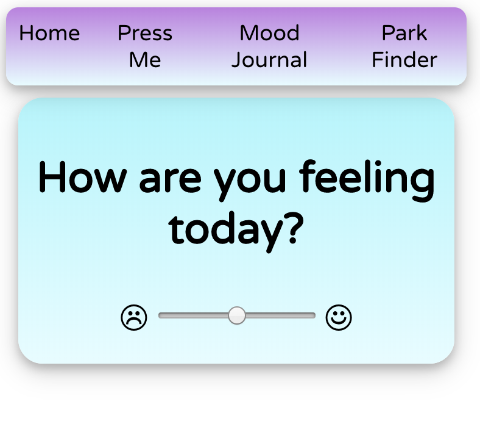
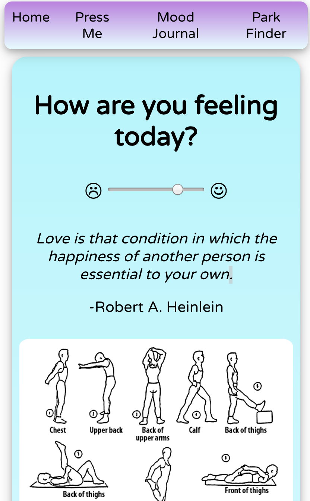
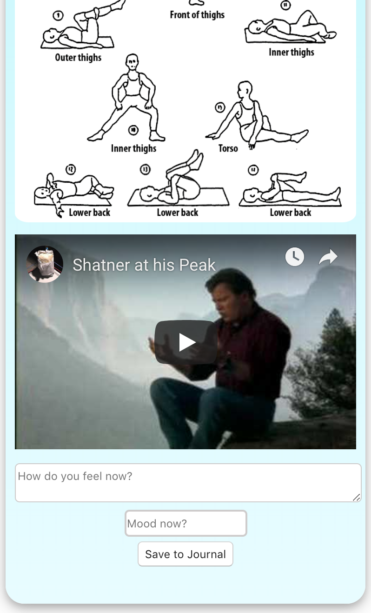
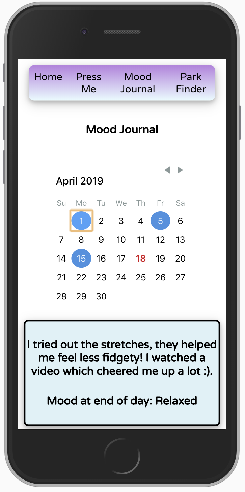
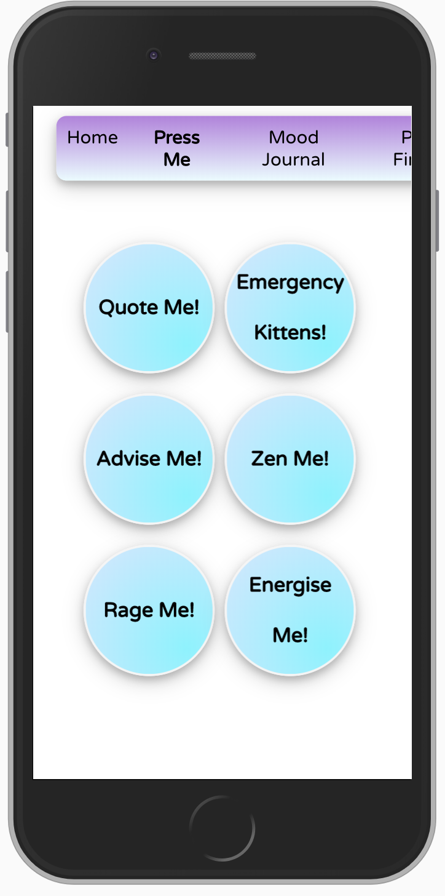
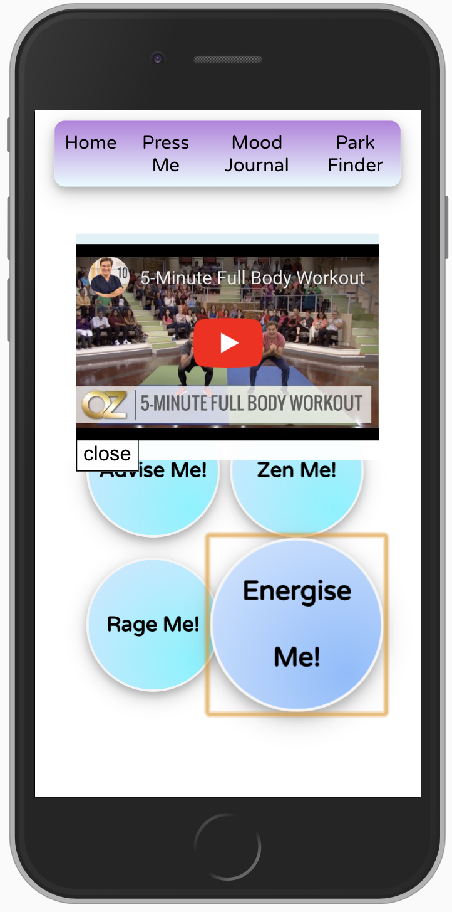

# Meditation

## Project description

A team project where we created our own idea and wrote our own MVP and extensions.

We used:

Java
PSQL
Spring
JavaScript
React

## Aim

Task is to create a web application that allows a user to select their mood on that day and the program provides some information on how it can be improved.

The user can then view a mood journal which displays what strategies were effective and ineffective over a period of time.

## MVP

- User should be able to select a mood from a mood slider
- The user reviews a corresponding quote, stretch diagram and video
- User can fill a journal where they can add a comment on whether or not it was effective
- User should be able to review their mood journal diary to view what they wrote and their mood on that day

## Extensions

- Link corresponding quote to walks in the local area or recreation activities (with a map)
- Breathing exercises to ease anxiety or similar moods (with a metronome)
- "Zen Me" button plays calming ambience
- Yoga poses for specific muscle groups

## Super Extensions

- Add other buttons: "Rage Me", "Energise Me", "Emergency Kittens"

## Screen Grabs

_screen home_

_mood selected_

_mood selected_

_mood journal_

_buttons_

_button selected_

## Available Scripts

In the project directory, you can run:

### `npm start`

Runs the app in the development mode. 
Open [http://localhost:3000](http://localhost:3000) to view it in the browser.

The page will reload if you make edits. 
You will also see any lint errors in the console.
